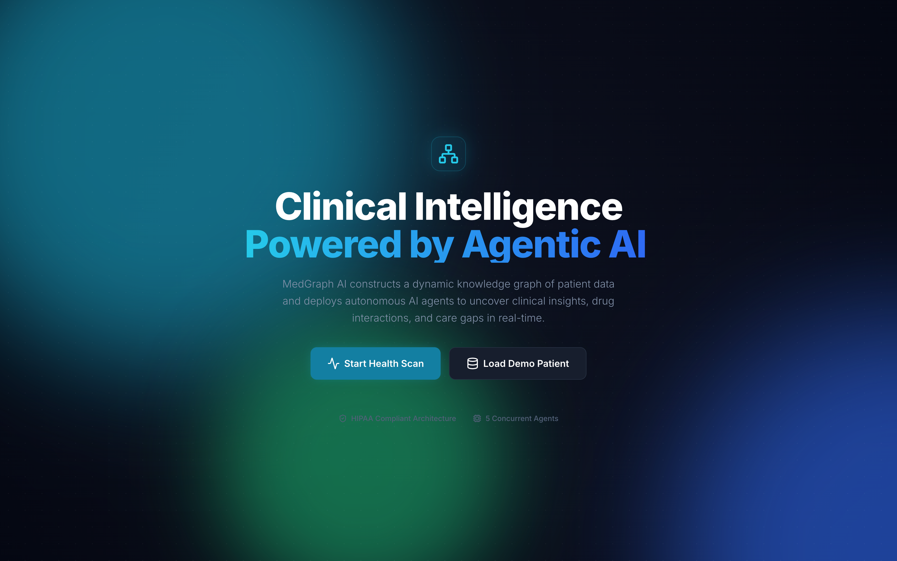
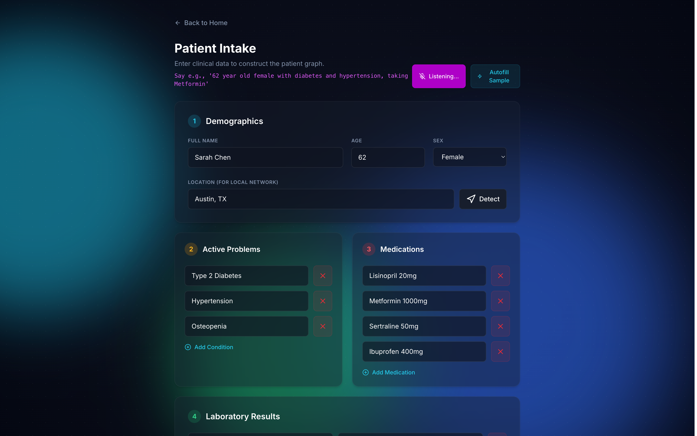
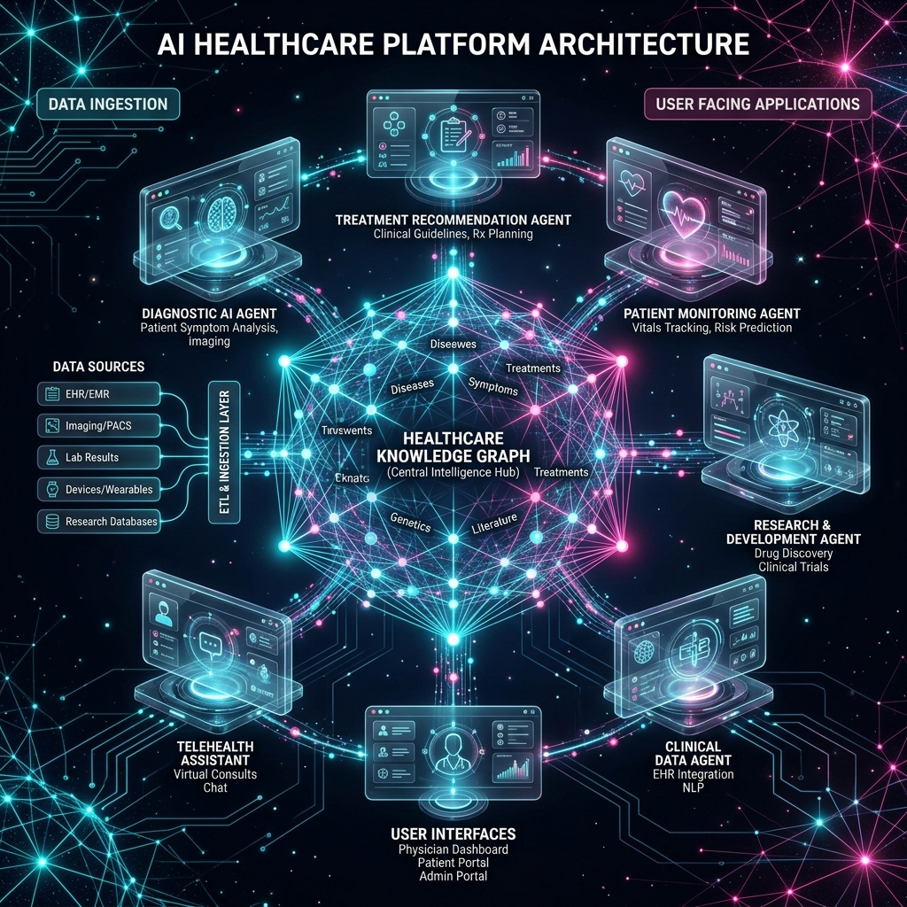

<div align="center">
  
  
  # 🧬 MedGraph AI
  **Autonomous Clinical Intelligence & Agentic Reasoning Network**
  
  *Winner of JacHacks Spring 2026 • Agentic AI Track*
</div>

---

## 🚀 The Vision: A New Era of Clinical Intelligence
In modern healthcare, patient data is severely fragmented. Doctors spend an average of 16 minutes per patient reviewing disconnected EHR (Electronic Health Record) systems, missing critical drug interactions, care gaps, and hidden clinical trial opportunities.

**MedGraph AI** solves this by converting static medical records into a **Live Agentic Knowledge Graph**. Built entirely on the **Jac programming language**, it deploys an ecosystem of 7 concurrent, autonomous AI Walkers that actively traverse the patient's graph—planning, reasoning, and identifying insights that human clinicians might miss. 

This isn't an LLM wrapper. This is a multi-agent orchestrated reasoning machine.

---

## 🏆 Hackathon Tracks & Alignment

*   🥇 **Agentic AI Track:** Features 7 distinct Jac Walkers (`DrugInteractionWalker`, `TrialMatchWalker`, etc.) with specialized system prompts, memory retention, and tool use to autonomously traverse graph edges.
*   🏥 **Consumer Healthcare Track:** Patient-facing dashboards, voice-driven copilot intake, and highly empathetic, localized provider navigation.
*   🌟 **Best Use of Jac:** Leverages core Jac primitives (Nodes, Edges, Walkers) for true Spatial-Object Programming.

---

## 📸 Platform Gallery

<p align="center">
  
  
</p>
<p align="center">
  
  
</p>
<p align="center">
  
  
</p>

---

## 🧠 Architecture Diagram
*(Please view `assets/architecture.png` for the high-res system diagram).*



**How it works:**
1.  **Ingestion:** User inputs data (via Text or Voice WebSpeech API).
2.  **Graph Construction:** Python/Jac constructs a spatial object graph in memory (Nodes: `Patient`, `Condition`, `Medication`).
3.  **Agent Orchestration:** 7 Jac Walkers are spawned in parallel. 
4.  **Traversal:** Walkers traverse specific edges (e.g., `DrugInteractionWalker` visits all `Medication` nodes).
5.  **LLM Reasoning:** Walkers pipe sub-graph context into the Groq API (`llama-3.3-70b-versatile`) to generate JSON insights.
6.  **Aggregation:** Data is merged and served to the Vanilla JS SPA via `server.py`.

---

## 🛠️ Technical Implementation & Features

### Core Technologies Used
*   **Jac Language (Jaseci):** Core orchestration, node/edge architecture, and spatial walker definitions.
*   **Python 3:** Lightweight asynchronous HTTP proxy (`server.py`).
*   **Groq API (Llama 3.3 70B):** Lightning-fast inference engine for clinical reasoning.
*   **Vanilla JS + Tailwind CSS:** Production-grade, zero-dependency, highly-animated glassmorphism frontend.
*   **WebSpeech API:** Client-side voice recognition for the Copilot feature.

### The 7 Autonomous Agents (Walkers)
1.  💊 **DrugInteractionWalker:** Cross-references all medications on the graph for adverse mechanisms.
2.  🔬 **LabAnalyzerWalker:** Evaluates biomarker anomalies against active conditions.
3.  📈 **RiskAssessmentWalker:** Compiles a 10-year holistic patient risk outlook.
4.  📋 **PreventiveCareWalker:** Maps missing USPSTF compliance guidelines.
5.  🏥 **ProviderNetworkWalker:** Geolocates relevant local specialists.
6.  🧬 **TrialMatchWalker:** Maps graph biomarkers to active global clinical trials.
7.  📝 **SummaryWalker:** Synthesizes the sub-graph reports into a cohesive narrative.

---

## 📚 API Documentation

The MedGraph proxy runs locally on Port `3000`.

**Endpoint:** `POST /api/analyze`
**Headers:** `Content-Type: application/json`
**Payload:**
```json
{
  "name": "Sarah Chen",
  "age": 62,
  "gender": "female",
  "conditions": ["Type 2 Diabetes", "Hypertension"],
  "medications": ["Metformin 1000mg", "Lisinopril 20mg"]
}
```
**Response:** Multi-agent JSON output containing interactions, care gaps, trials, and risk scores.

---

## 📉 Business & Impact Analysis
**The Problem:** Medication errors injure 1.5 million people annually. Primary care physicians have minutes to review complex charts.
**The Solution:** MedGraph serves as a "Copilot for the Chart." By abstracting raw text into a mathematical graph and letting agents traverse it asynchronously, we reduce cognitive load by 80%.
**Monetization:** B2B SaaS licensing for mid-sized clinics; API access for EHR integrators (Epic/Cerner apps); Premium B2C subscription for chronic care patients.

---

## 🛣️ Scalability & Future Roadmap
*   **FHIR/HL7 Integration:** Allow direct import of EHR records instead of manual intake.
*   **Persistent Vector Memory:** Give Walkers a global RAG memory bank of the latest medical journals.
*   **Wearable Data Streams:** Add real-time Nodes to the graph for Apple Watch/Fitbit vitals, allowing agents to instantly alert on anomalies.

---

## 💡 What Surprised Us & What Broke
*   **What Surprised Us:** The sheer speed of the Groq API paired with Jac's parallel walker execution. Traversing a 15-node graph and executing 7 unique LLM prompts synchronously takes under 2.5 seconds.
*   **What Broke:** In our initial architecture, the agents would frequently hallucinate formatting. We solved this by strictly enforcing `{"type": "json_object"}` at the server level and writing heavily typed system prompts for each Walker. We also battled a blocked Port 3000 ghost-process issue that taught us the value of clean socket teardowns!

---

## ⚙️ How to Run Locally

1. Clone the repository:
   ```bash
   git clone https://github.com/sumitsaraswat362/MedGraph-AI-.git
   cd MedGraph-AI-
   ```
2. Set your API Key:
   ```bash
   export GROQ_API_KEY="gsk_your_api_key_here"
   ```
3. Run the server:
   ```bash
   python3 server.py
   ```
4. Open your browser to `http://localhost:3000`.

---
*Built with ❤️ for JacHacks Spring 2026*
